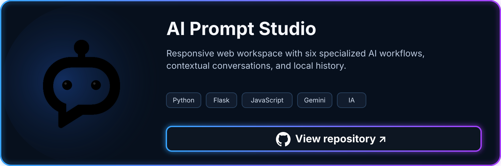
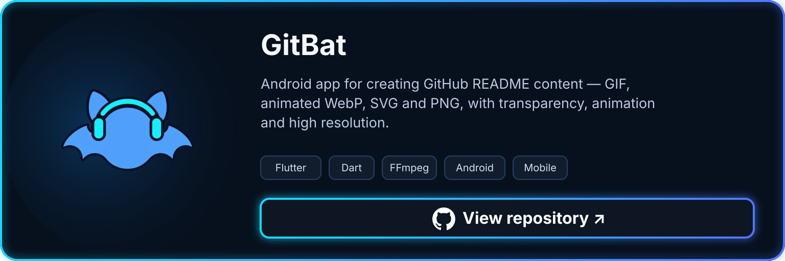
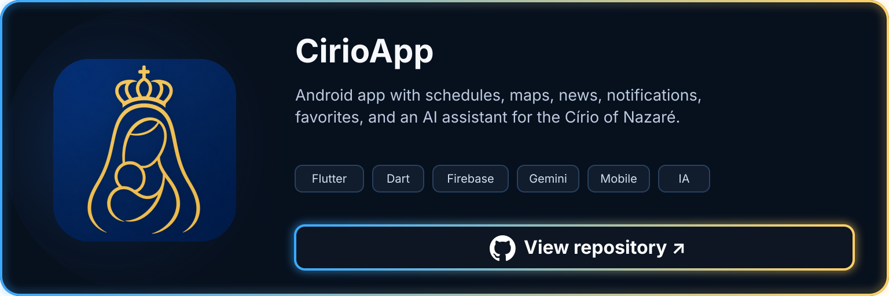
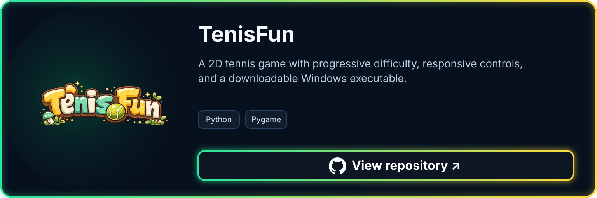

  <strong><big><big>Hi there!  </big></big></strong>
  

  
  

  🌐 Belém - PA, Brazil 
  

I'm Liane,  
a Computer Science student from Brazil, 
passionate about software development, AI, 
Computer Graphics and building useful projects 💙

Here you'll find a mix of apps, experiments, 
automations, and projects I'm developing while 
learning and growing in tech. 🦾

  <strong><big><big>TECHNOLOGIES</big></big></strong>

  Languages

  
  
  

  Data &amp; AI

  
  
  
  
  

  Mobile

  
  

  Tools

  
  
  

  <strong><big><big>FEATURED PROJECTS</big></big></strong>

Four projects showcasing mobile development, game development, artificial intelligence, and developer tools.

<table>
<tr>
<td align="center" width="50%" valign="top">

</td>
<td align="center" width="50%" valign="top">

</td>
</tr>
<tr>
<td align="center" width="50%" valign="top">

</td>
<td align="center" width="50%" valign="top">

</td>
</tr>
</table>

 

  <picture>
    <source media="(prefers-color-scheme: dark)" srcset="./assets/image/github-stats.svg?v=33-12-16-3013-2026">
    <source media="(prefers-color-scheme: light)" srcset="./assets/image/github-stats-light.svg?v=33-12-16-3013-2026">
    
  </picture>

  
