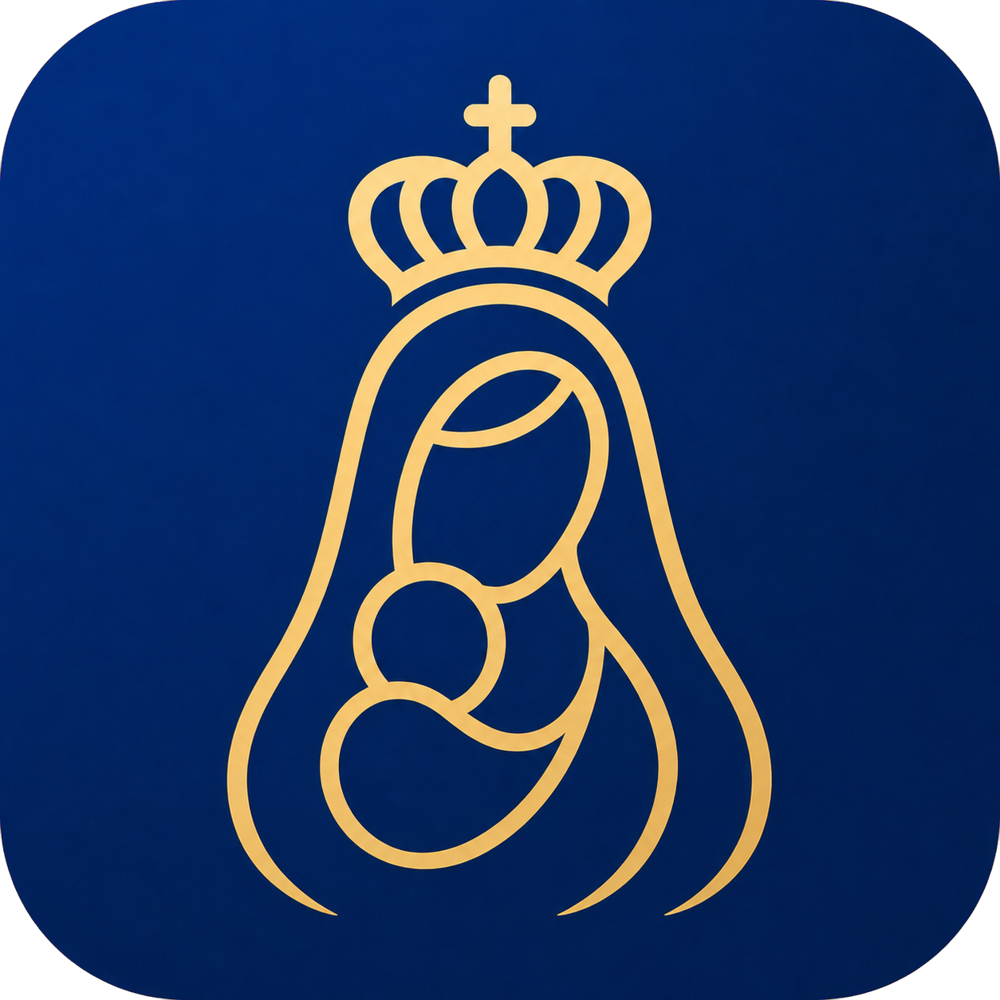
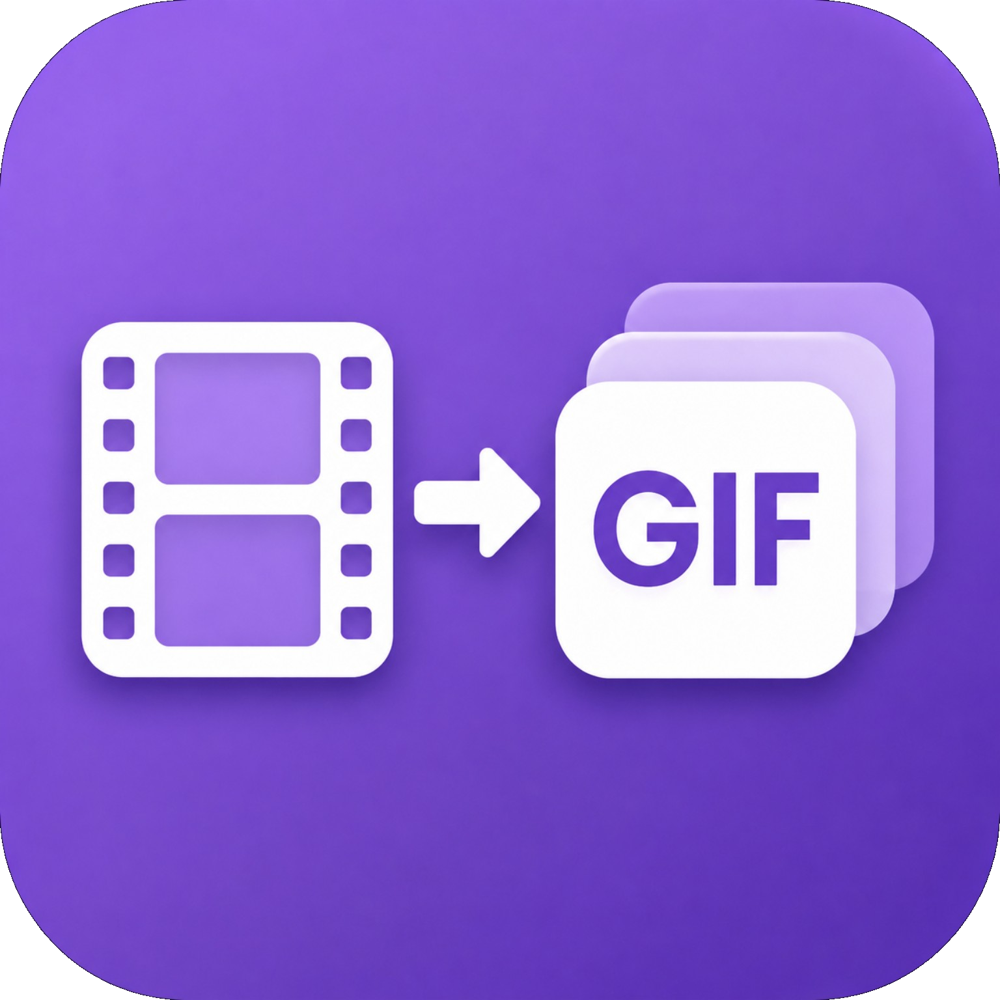

<picture>
  <source media="(prefers-color-scheme: dark)" srcset="./assets/image/liane-dev-portal.svg?v=1">
  <source media="(prefers-color-scheme: light)" srcset="./assets/image/liane-dev-portal-light.svg?v=1">
  
</picture>

  <strong><big><big>Hi there!</big></big></strong>
  

  
  

  🌐 Belém - PA, Brazil 
  

I'm Liane,  
a Computer Science student from Brazil, 
passionate about software development, AI, data, 
and building useful projects 💙

Here you'll find a mix of apps, experiments, 
automations, and projects I'm developing while 
learning and growing in tech. 🦾

  <strong><big><big>TECHNOLOGIES</big></big></strong>

  Languages

  
  
  

  Data &amp; AI

  
  
  
  
  

  Mobile

  
  

  Tools

  
  
  

  <strong><big><big>FEATURED PROJECTS</big></big></strong>

Four projects showcasing mobile development, game development, artificial intelligence, and developer tools.

<table>
  <tr>
    <td align="center" width="50%" valign="top">
       
      
      
<strong><big><a href="https://github.com/lianeheidemann/cirioapp_v2">CírioApp</a></big></strong>

      
Android app with schedules, maps, news, notifications, favorites, and an AI assistant for the Círio of Nazaré.

      
<code>Flutter</code> <code>Dart</code> <code>Firebase</code> <code>Gemini</code> <code>Mobile</code> <code>IA</code>

       
    </td>
    <td align="center" width="50%" valign="top">
       
      
      
<strong><big><a href="https://github.com/lianeheidemann/tennis-fun-game">TenisFun</a></big></strong>

      
A 2D tennis game with progressive difficulty, responsive controls, and a downloadable Windows executable.

      
<code>Python</code> <code>Pygame</code>

       
    </td>
  </tr>
</table>

<table>
  <tr>
    <td align="center" width="50%" valign="top">
       
      
      
<strong><big><a href="https://github.com/lianeheidemann/ai-prompt-studio">AI Prompt Studio</a></big></strong>

      
Responsive web workspace with six specialized AI workflows, contextual conversations, and local history.

      
<code>Python</code> <code>Flask</code> <code>JavaScript</code> <code>Gemini</code> <code>IA</code>

       
    </td>
    <td align="center" width="50%" valign="top">
       
      
      
<strong><big><a href="https://github.com/lianeheidemann/video-to-gif">Video to GIF</a></big></strong>

      
Android app that converts videos to GIF with trimming, crop, resolution and frame controls.

      
<code>Flutter</code> <code>Dart</code> <code>FFmpeg</code> <code>Android</code> <code>Mobile</code>
      

       
    </td>
  </tr>
</table> 

  <picture>
    <source media="(prefers-color-scheme: dark)" srcset="./assets/image/github-stats.svg?v=27-9-15-1917-2026">
    <source media="(prefers-color-scheme: light)" srcset="./assets/image/github-stats-light.svg?v=27-9-15-1917-2026">
    
  </picture>

  
