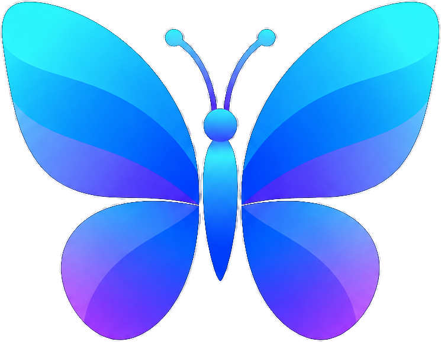
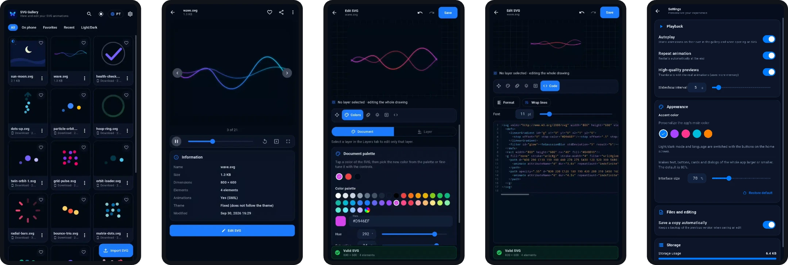

  <strong><big><big>Hi there!  </big></big></strong>
  

  
  

  🌐 Belém - PA, Brazil 
  

I'm Liane, 
a Computer Science student from Brazil, 
with a passion for software development, AI, and computer graphics. 
I enjoy building useful projects and exploring new ideas. 💙

Here you'll find my apps, experiments, and automation projects, 
as I continue learning and growing in tech. 🦾

  <strong><big><big>TECHNOLOGIES</big></big></strong>

  Languages

  
  
  

  Data &amp; AI

  
  
  
  
  

  Mobile Development

  
  

  3D &amp; Graphics

  
  
  
  
  

  Developer Tools &amp; Cloud

  
  
  

<h2 align="center">3D, Graphics &amp; Computer Vision Projects</h2>

Selected projects in 3D visualization, simulation, animation, and image processing.

<table width="100%" style="width:100%; table-layout:fixed;"><colgroup><col width="50%"><col width="50%"></colgroup>

<tr>
<td align="center" width="50%" style="width:50%;" valign="top">
  
<strong><a href="https://github.com/lianeheidemann/object-inspector">Object Inspector</a></strong>

  Static viewer for geometric deviation heatmaps on 3D surfaces. <code>A-Frame</code> <code>Three.js</code> <code>WebGL</code>

</td>
<td align="center" width="50%" style="width:50%;" valign="top">
  
<strong><a href="https://github.com/lianeheidemann/vehicle-3d-showroom">Vehicle 3D Showroom</a></strong>

Browser-based 3D vehicle showroom with interactive models and gamepad support. <code>A-Frame</code> <code>Three.js</code> <code>JavaScript</code> <code>Gamepad API</code>

</td>
</tr>
<tr>
<td align="center" width="50%" style="width:50%;" valign="top">
 
  
<strong><a href="https://github.com/lianeheidemann/mesh-comparison">Mesh Comparison</a></strong>

  Python workspace for geometric and perceptual comparison of reconstructed 3D meshes. <code>Python</code> <code>Open3D</code> <code>LPIPS</code>

</td>
<td align="center" width="50%" style="width:50%;" valign="top">
 
<a href="https://github.com/lianeheidemann/parallel-image-pipeline">
<picture>
<source media="(max-width: 600px) and (prefers-color-scheme: dark)" srcset="https://raw.githubusercontent.com/lianeheidemann/parallel-image-pipeline/main/assets/logo/logo-dark-v2.png" width="500">
<source media="(max-width: 600px) and (prefers-color-scheme: light)" srcset="https://raw.githubusercontent.com/lianeheidemann/parallel-image-pipeline/main/assets/logo/logo.png" width="500" >
<source media="(prefers-color-scheme: dark)" srcset="https://raw.githubusercontent.com/lianeheidemann/parallel-image-pipeline/main/assets/logo/logo-dark-v2.png" width="500">
<source media="(prefers-color-scheme: light)" srcset="https://raw.githubusercontent.com/lianeheidemann/parallel-image-pipeline/main/assets/logo/logo.png" width="500" >

</picture>
</a>  
<strong><a href="https://github.com/lianeheidemann/parallel-image-pipeline">Parallel Image Pipeline</a></strong>

  Experimental image-processing pipeline comparing sequential and parallel execution in Python and the browser, with AWS benchmarks. <code>Python</code> <code>OpenCV</code> <code>AWS</code>

</td>
</tr>
<tr>
<td align="center" width="50%" style="width:50%;" valign="top">
  
<strong><a href="https://github.com/lianeheidemann/mini-driving-simulator-3d">Mini Driving Simulator 3D</a></strong>

Browser-based driving simulator with keyboard and Xbox-compatible gamepad controls. <code>A-Frame</code> <code>Three.js</code> <code>Gamepad API</code>

</td>
<td align="center" width="50%" style="width:50%;" valign="top">
  
<strong><a href="https://github.com/lianeheidemann/porcelain-inspection-unity">Porcelain Inspection</a></strong>

Unity 3D prototype for rotating, zooming, and inspecting points on a porcelain piece. <code>Unity 6</code> <code>C#</code>

</td>
</tr>
<tr>
<td align="center" width="50%" style="width:50%;" valign="top">
  
<strong><a href="https://github.com/lianeheidemann/atividades-processamento-de-imagens">Image Processing Activities</a></strong>

Coursework in quantization, histograms, gamma correction, enhancement, and segmentation. <code>Python</code> <code>OpenCV</code> <code>NumPy</code>

</td>
<td align="center" width="50%" style="width:50%;" valign="top">
  
<strong><a href="https://github.com/lianeheidemann/3d-animations">3D Animations</a></strong>

Blender collection of character and prop animations, with source and export files. <code>Blender</code> <code>glTF/GLB</code>

</td>
</tr>
</table>

<h2 align="center">Hardware Projects</h2>

Arduino and Bluetooth-controlled hardware projects.

<table width="100%" style="width:100%; table-layout:fixed;"><colgroup><col width="50%"><col width="50%"></colgroup>
<tr>
<td align="center" width="50%" style="width:50%;" valign="top">
  
<strong><a href="https://github.com/lianeheidemann/bluetooth-robotic-car-claw">Bluetooth Robotic Car with Mechanical Claw</a></strong>

Arduino car controlled over Bluetooth, with a mobile joystick and a mechanical claw. <code>Arduino</code> <code>Bluetooth</code>

</td>
<td align="center" width="50%" style="width:50%;" valign="top">
  
<strong><a href="https://github.com/lianeheidemann/automated-greenhouse-prototype">Automated Greenhouse Prototype</a></strong>

Arduino greenhouse monitor for temperature, air humidity, and soil moisture, with LCD and Bluetooth reporting. <code>Arduino</code> <code>Bluetooth</code>

</td>
</tr>
</table>

 

<h2 align="center">Featured Projects</h2>

Four projects showcasing mobile development, game development, artificial intelligence, and developer tools.

<table width="100%" style="width:100%; table-layout:fixed;"><colgroup><col width="50%"><col width="50%"></colgroup>
<tr>
<td align="center" width="50%" style="width:50%;" valign="top">
 

  
<strong><a href="https://github.com/lianeheidemann/ai-prompt-studio">AI Prompt Studio</a></strong>
  
<a href="https://github.com/lianeheidemann/ai-prompt-studio">
<picture>
<source media="(prefers-color-scheme: dark)" srcset="assets/badge/view-repository-dark-v1.png">
<source media="(prefers-color-scheme: light)" srcset="assets/badge/view-repository-light-v1.png">

</picture>
</a>

Responsive web workspace with six specialized AI workflows,
contextual conversations, and local history.

<code>Python</code> <code>Flask</code> <code>Gemini</code>

  
</td>

<td align="center" width="50%" style="width:50%;" valign="top">
 

  
<strong>🏆💙 <a href="https://github.com/lianeheidemann/gitbat-app">GitBat</a> 💙🏆</strong>
  
<a href="https://github.com/lianeheidemann/gitbat-app">
<picture>
<source media="(prefers-color-scheme: dark)" srcset="assets/badge/view-repository-dark-v1.png">
<source media="(prefers-color-scheme: light)" srcset="assets/badge/view-repository-light-v1.png">

</picture>
</a>

Android app for creating GitHub README content — GIF,
animated WebP, SVG and PNG, with transparency,
animation and high resolution.

<code>Flutter</code> <code>Dart</code> <code>FFmpeg</code>

  
</td>
</tr>

<tr>
<td align="center" width="50%" style="width:50%;" valign="top">
 

  
<strong><a href="https://github.com/lianeheidemann/cirioapp-v2">CírioApp</a></strong>
  
<a href="https://github.com/lianeheidemann/cirioapp-v2">
<picture>
<source media="(prefers-color-scheme: dark)" srcset="assets/badge/view-repository-dark-v1.png">
<source media="(prefers-color-scheme: light)" srcset="assets/badge/view-repository-light-v1.png">

</picture>
</a>

Android app with schedules, maps, news, notifications,
favorites, and an AI assistant for the Círio of Nazaré.

<code>Flutter</code> <code>Firebase</code> <code>Gemini</code>

  
</td>

<td align="center" width="50%" style="width:50%;" valign="top">
 
<picture>
<source media="(max-width: 600px) and (prefers-color-scheme: dark)" srcset="./assets/projects/logos/spriteflow-logo-dark.png?v=2" width="65" height="60">
<source media="(max-width: 600px) and (prefers-color-scheme: light)" srcset="./assets/projects/logos/spriteflow-logo-light.png?v=2" width="65" height="60">
<source media="(prefers-color-scheme: dark)" srcset="./assets/projects/logos/spriteflow-logo-dark.png?v=2" width="95" height="88">
<source media="(prefers-color-scheme: light)" srcset="./assets/projects/logos/spriteflow-logo-light.png?v=2" width="95" height="88">

</picture>
  
<strong>SpriteFlow</strong>
  
<picture>
<source media="(prefers-color-scheme: dark)" srcset="https://img.shields.io/badge/%F0%9F%9A%A7-In%20Development-2563EB?style=flat-square&amp;labelColor=1F2937">
<source media="(prefers-color-scheme: light)" srcset="https://img.shields.io/badge/%F0%9F%9A%A7-In%20Development-1D4ED8?style=flat-square&amp;labelColor=E5E7EB">

</picture>

Flutter app for importing sprite sheets, editing frames,
and exporting ready-to-use animations and images.

<code>Flutter</code> <code>Dart</code> <code>Riverpod</code>

  
</td>
</tr>
</table>

<h2 align="center">Coming Soon</h2>

<table width="100%" style="width:100%; table-layout:fixed;">
<tr>
<td align="center" width="100%" valign="top">
 
<picture>
<source media="(max-width: 600px)" srcset="./assets/projects/logos/svg-motion-gallery-icon-v1.png" height="40">
<source srcset="./assets/projects/logos/svg-motion-gallery-icon-v1.png" width="114" height="88">

</picture>
  

  
<strong>SVG Motion Gallery</strong>
  
<picture>
<source media="(prefers-color-scheme: dark)" srcset="https://img.shields.io/badge/%F0%9F%9A%A7-In%20Development-2563EB?style=flat-square&amp;labelColor=1F2937">
<source media="(prefers-color-scheme: light)" srcset="https://img.shields.io/badge/%F0%9F%9A%A7-In%20Development-1D4ED8?style=flat-square&amp;labelColor=E5E7EB">

</picture>

Mobile app for browsing, previewing, and editing animated SVG files. <code>Flutter</code> <code>Dart</code> <code>SVG</code>

  
</td>
</tr>
</table>

  <a href="https://github.com/lianeheidemann/lianeheidemann/blob/main/PROJECTS.md">
    <picture>
      <source media="(prefers-color-scheme: dark)" srcset="./assets/projects/project-list-cta-dark-v2.webp?v=2">
      <source media="(prefers-color-scheme: light)" srcset="./assets/projects/project-list-cta-light-v2.webp?v=2">
      
    </picture>
  </a>

  <picture>
    <source media="(prefers-color-scheme: dark)" srcset="./assets/image/github-stats.svg?v=33-12-18-3162-2026">
    <source media="(prefers-color-scheme: light)" srcset="./assets/image/github-stats-light.svg?v=33-12-18-3162-2026">
    
  </picture>

  
