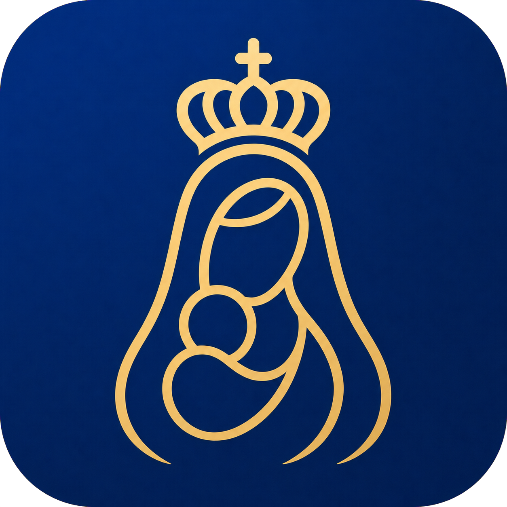

  <strong><big><big>Hi there!  </big></big></strong>
  

  
  

  🌐 Belém - PA, Brazil 
  

I'm Liane,  
a Computer Science student from Brazil, 
passionate about software development, AI, 
Computer Graphics and building useful projects 💙

Here you'll find a mix of apps, experiments, 
automations, and projects I'm developing while 
learning and growing in tech. 🦾

  <strong><big><big>TECHNOLOGIES</big></big></strong>

  Languages

  
  
  

  Data &amp; AI

  
  
  
  
  

  Mobile

  
  

  Tools

  
  
  

<h2 align="center">3D, Graphics &amp; Computer Vision Projects</h2>

Selected projects in 3D visualization, simulation, animation, and image processing.

<table width="100%">
<tr>
<td align="center" width="50%" valign="top">
  
<strong><a href="https://github.com/lianeheidemann/object-inspector">Object Inspector</a></strong>

Static viewer for geometric deviation heatmaps on 3D surfaces.

</td>
<td align="center" width="50%" valign="top">
  
<strong><a href="https://github.com/lianeheidemann/vehicle-3d-showroom">Vehicle 3D Showroom</a></strong>

Browser-based 3D vehicle showroom with interactive models and gamepad support.

</td>
</tr>
<tr>
<td align="center" width="50%" valign="top">
  
<strong><a href="https://github.com/lianeheidemann/mini-driving-simulator-3d">Mini Driving Simulator 3D</a></strong>

Browser-based driving simulator with keyboard and Xbox-compatible gamepad controls.

</td>
<td align="center" width="50%" valign="top">
  
<strong><a href="https://github.com/lianeheidemann/porcelain-inspection-unity">Porcelain Inspection</a></strong>

Unity 3D prototype for rotating, zooming, and inspecting points on a porcelain piece.

</td>
</tr>
<tr>
<td align="center" width="50%" valign="top">
  
<strong><a href="https://github.com/lianeheidemann/atividades-processamento-de-imagens">Image Processing Activities</a></strong>

Coursework in quantization, histograms, gamma correction, enhancement, and segmentation.

</td>
<td align="center" width="50%" valign="top">
  
<strong><a href="https://github.com/lianeheidemann/3d-animations">3D Animations</a></strong>

Blender collection of character and prop animations, with source and export files.

</td>
</tr>
<tr>
<td align="center" width="50%" valign="top">
  
<strong><a href="https://github.com/lianeheidemann/mesh-comparison">Mesh Comparison</a></strong>

 Python workspace for geometric and perceptual comparison of reconstructed 3D meshes.

</td>
<td width="50%"></td>
</tr>
</table>

<h2 align="center">Hardware Projects</h2>

Arduino and Bluetooth-controlled hardware projects.

<table width="100%">
<tr>
<td align="center" width="50%" valign="top">
  
<strong><a href="https://github.com/lianeheidemann/bluetooth-robotic-car-claw">Bluetooth Robotic Car with Mechanical Claw</a></strong>

Arduino car controlled over Bluetooth, with a mobile joystick and a mechanical claw.

</td>
<td align="center" width="50%" valign="top">
  
<strong><a href="https://github.com/lianeheidemann/automated-greenhouse-prototype">Automated Greenhouse Prototype</a></strong>

Arduino greenhouse monitor for temperature, air humidity, and soil moisture, with LCD and Bluetooth reporting.

</td>
</tr>
</table>

 

<h2 align="center">Featured Projects</h2>

Four projects showcasing mobile development, game development, artificial intelligence, and developer tools.

<table>
<tr>
<td align="center" width="50%" valign="top">
 

  
<strong><a href="https://github.com/lianeheidemann/ai-prompt-studio">AI Prompt Studio</a></strong>
  
<a href="https://github.com/lianeheidemann/ai-prompt-studio">
<picture>
<source media="(prefers-color-scheme: dark)" srcset="assets/badge/view-repository-dark-v1.png">
<source media="(prefers-color-scheme: light)" srcset="assets/badge/view-repository-light-v1.png">

</picture>
</a>

Responsive web workspace with six specialized AI workflows,
contextual conversations, and local history.

<code>Python</code>
<code>Flask</code>
<code>JavaScript</code>
<code>Gemini</code>
<code>IA</code>

  
</td>

<td align="center" width="50%" valign="top">
 

  
<strong><a href="https://github.com/lianeheidemann/gitbat-app">GitBat</a></strong>
  
<a href="https://github.com/lianeheidemann/gitbat-app">
<picture>
<source media="(prefers-color-scheme: dark)" srcset="assets/badge/view-repository-dark-v1.png">
<source media="(prefers-color-scheme: light)" srcset="assets/badge/view-repository-light-v1.png">

</picture>
</a>

Android app for creating GitHub README content — GIF,
animated WebP, SVG and PNG, with transparency,
animation and high resolution.

<code>Flutter</code>
<code>Dart</code>
<code>FFmpeg</code>
<code>Android</code>
<code>Mobile</code>

  
</td>
</tr>

<tr>
<td align="center" width="50%" valign="top">
 

  
<strong><a href="https://github.com/lianeheidemann/cirioapp-v2">CírioApp</a></strong>
  
<a href="https://github.com/lianeheidemann/cirioapp-v2">
<picture>
<source media="(prefers-color-scheme: dark)" srcset="assets/badge/view-repository-dark-v1.png">
<source media="(prefers-color-scheme: light)" srcset="assets/badge/view-repository-light-v1.png">

</picture>
</a>

Android app with schedules, maps, news, notifications,
favorites, and an AI assistant for the Círio of Nazaré.

<code>Flutter</code>
<code>Dart</code>
<code>Firebase</code>
<code>Gemini</code>
<code>Mobile</code>
<code>IA</code>

  
</td>

<td align="center" width="50%" valign="top">
 

  
<strong><a href="https://github.com/lianeheidemann/tennis-fun-game">TenisFun</a></strong>
  
<a href="https://github.com/lianeheidemann/tennis-fun-game">
<picture>
<source media="(prefers-color-scheme: dark)" srcset="assets/badge/view-repository-dark-v1.png">
<source media="(prefers-color-scheme: light)" srcset="assets/badge/view-repository-light-v1.png">

</picture>
</a>

A 2D tennis game with progressive difficulty,
responsive controls, and a downloadable Windows executable.

<code>Python</code>
<code>Pygame</code>

  
</td>
</tr>
</table>

  <picture>
    <source media="(prefers-color-scheme: dark)" srcset="./assets/image/github-stats.svg?v=33-12-16-3013-2026">
    <source media="(prefers-color-scheme: light)" srcset="./assets/image/github-stats-light.svg?v=33-12-16-3013-2026">
    
  </picture>

  
